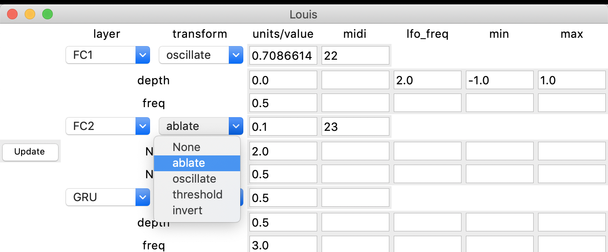

# Network Bending Neural Vocoders
## Louis McCallum and Matthew Yee-King
Repo for Network Bending Neural Vocoders demo. Supported by [HDI Network](https://hdi-network.org/), [MIMIC project](https://mimicproject.com/) and [Google AMI](https://medium.com/artists-and-machine-intelligence/research-awards-2021-64df3f7f213b).

## Papers

[Network Bending Neural Vocoders](https://drive.google.com/file/d/18FZXxBMBES5BYtqqm6OZKoGXXtPS98Gc/view) @ NeurIPS 2020, Machine Learning for Creativity and Design Workshop

[Studio report: sound synthesis with DDSP andnetwork bending techniques](https://aimc2021.iem.at/wp-content/uploads/2021/06/AIMC_2021_YeeKing_McCallum.pdf) @ 2nd Conference on AI Music Creativity (MuMe + CSMC) 2021

## Audio Examples

[Audio examples](http://louismccallum.com/network-bending-audio-examples)

## Running interface

We provide a Python implementation with GUI interface, which should run in real time on normal (CPU) laptops (tested on 2019 Macbook Pro). As with other DDSP examples, this will pulll the pitch and amplitude from a given audio file and use that to power the model.

1. Clone Repo

2. Install

   a. ddsp, tensorflow, gin, numpy, pandas, scipy, librosa, sounddevice, mido, python-rtmidi

3. Run `python gui.py`. This will load the default flute model, and 1 minute of White Houston audio as an input file. You can provide your own models, input audio file and midi port (if using midi controller) as arguments here.

For example 

``
python gui.py -i my_audio_file.wav -m ddsp_sax_model -p "Akai MPD controller 1"
``

```
   usage: gui.py [-h] [-i INPUT_AUDIO] [-p MIDI_PORT] [-m MODEL]

   optional arguments:
     -h, --help            show this help message and exit
     -i INPUT_AUDIO, --input_audio INPUT_AUDIO
                           name of file in audio_data directory
     -p MIDI_PORT, --midi_port MIDI_PORT
                           name of midi port to connect to
     -m MODEL, --model MODEL
                           name of folder containing model checkpoint in Models
                           folder
```

## Using the Software



When you are ready to begin, or want to update with new settings, click `Update`


You have 5 slots to chain the layer transformations. Transformations are applied to activations **following** each layer.  

### Layers

#### FC1

The first fully connected layer

#### GRU

The recurrent layer

#### FC2

The second fully connected layers

### Transforms

#### oscillate

Add an oscillation to the activations in the time dimension. This has two parameters (`freq` and `depth`).

#### ablate

Set activations to 0. This has no parameters.

#### invert

1 - activations. This has no parameters.

#### threshold

Set all values below the threshold to the minimum value of the activations matrix, and all values above the threshold to maximum value of the activations matrix. There is 1 parameter (`thresh`).

### Units

Set from 0 to 1 determining the proportion of units that the transform is applied to. Can be updated with the text input **or** can be controlled by `midi` (mapped 0-1), provide the `midi cc` channel in the `midi` input. Audio is generated in 4 second blocks so any changes will apply to the subsequent block of audio.

### Parameters

Some transforms (`oscillate` and `threshold`) have parameters that can be controlled by midi, or by set by an LFO. **Either** provide the `midi cc` channel in the `midi` input **or** an LFO frequency in the `lfo_freq` input. The `min` and `max` sets the range / mapping for either the LFO or midi controller.

#### After all updates, press the `Update` button to update the model!
